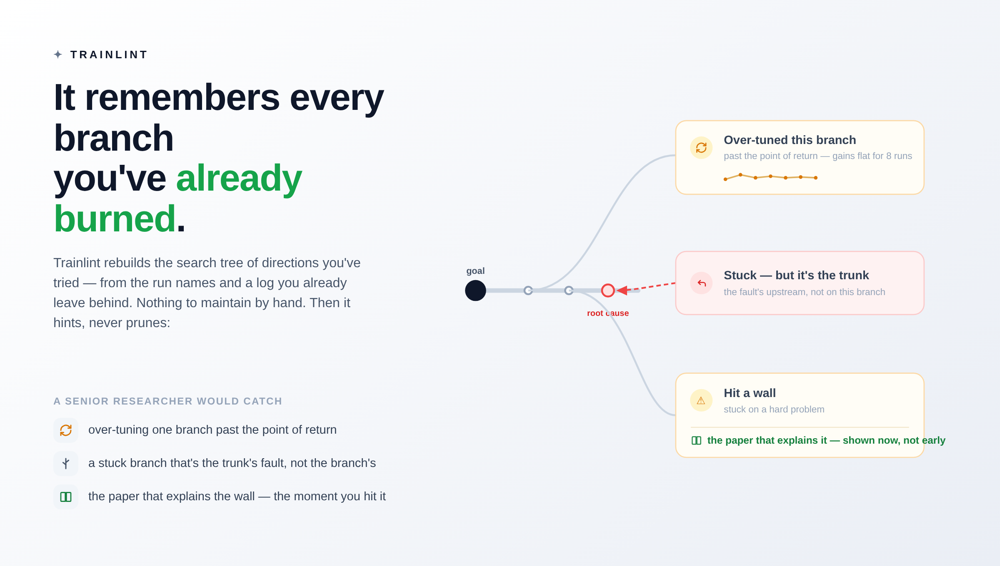

# Hansard

### The work, on the record.

Your AI agent now does real research work — writes the training code, launches the runs, draws
the conclusions. It's fast, and just as confident when it's wrong. And it all happens in a chat
log that scrolls away: decisions nobody wrote down, a goal that quietly drifts, a bug that never
crashed, findings that die when the session compacts.

**Hansard is the harness that puts the agent's work on the record.** It is three things at once:

1. **A doorman that perceives every move.** Every prompt, every tool call, every file read,
   every final report passes through it. It stays silent 99% of the time — and catches the
   silent mistake the moment it's typed.
2. **A compass that keeps the work aimed at the target.** The project is planned as explicit
   *decisions*; every turn re-injects the goal and the one decision everything waits on;
   high-stakes work on a decision you can't explain stops until you can.
3. **A multi-agent control plane.** The live report (phone + web) is where you *run* the
   project, not just read it: spawn a board of read-only investigator agents on any question,
   have one agent per feedback item deal with your notes, share the record with your team.

> Hansard grew out of **Trainlint**, a training-code linter — *"it trained fine; that's the
> bug."* The linter is still the floor everything else stands on.

---

## 1. It perceives every move the agent makes

Change a config, launch a run, touch the model, read a file, sign off with a report — the
doorman sees it, and reacts in proportion. Four channels, and the last one covers 99% of the
time:

| | when | who it bothers |
|---|---|---|
| 🚫 **reject** | a machine-certain mistake, or un-quizzed high-stakes work | nobody — the agent just redoes it |
| 🙋 **escalate** | a change only a human can judge | you — it hands you the diff |
| 👈 **coach** | a small "maybe check this" | the agent only |
| 😶 **silent** | 99% of the time | nobody |

**What that looks like.** Say the agent writes this loss, mid-flow:

```python
loss = F.cross_entropy(logits.view(-1, vocab), labels.view(-1))
```

It runs. The loss even drops. But the next-token shift is gone — the model is being asked to
predict each token from *itself*. Only you can say whether that's a bug — an autoregressive
model needs the shift; a diffusion model must *not* have it — so Hansard hands you the diff:

> *The loss lost its off-by-one shift (`logits[:, :-1]` vs `labels[:, 1:]`). Without it an
> autoregressive model just learns to copy its input — the loss keeps dropping while the output
> collapses to one repeated token. Please confirm.*

Nothing crashed. No test went red. The model would have spent the whole run learning to echo.
That's the week you keep.


**The perception is total, not keyword-deep:**

- **Every tool action** goes through a three-stage pipeline: a structural prefilter
  (default-open — reads, docs, and self-edits pass untouched), deterministic checks backed by
  *real verifiers* (mel-power, frozen-encoder contract, manifest leak, effective learning rate,
  shape-flow), and plan-aware routing (§2).
- **Every file read** is tracked. Edit a file the agent never read this session and it gets a
  quiet word — acting on unread code is where silent bugs hide.
- **Every final report** hits the report doorman on the `Stop` event: a plan report that skips
  the where-we-stand line, the map, or plain language — or forgets to deliver the HTML — gets
  bounced once for a rewrite.
- **Every session leaves a trace.** Before a session compacts, its judgments are harvested into
  the durable project log — append-only, stored outside the plugin tree so it survives both
  compaction and plugin upgrades. The next session starts from the record, not from zero.

Two things make it safe to leave on:

- **It blocks a move, never your direction.** A reject stops one action, not your approach.
  Information, not control; the judgment stays yours.
- **It can never lock you out.** The router is fail-open and always exits 0 — blocking happens
  only through a polite `permissionDecision: deny`, never a crash. A bug in the guard is safer
  than the bug it guards against.

## 2. It keeps the work aimed at the target

A silent bug isn't the only way to lose a week. You can also build the wrong thing — start
before you understand what you're building, or drift off the goal one busywork step at a time.

`/hansard:plan` walks the whole project in plain language — every term defined, every claim tied
to the actual code — and breaks it into the **decisions** that quietly determine whether it
works. Then it **quizzes you** on each until it sticks. From then on:

- **A compass, every turn.** Your **goal**, the **main thread** (the one decision that gates
  everything right now), and the **next action** are re-injected into every prompt — the agent
  stays locked on the target instead of wandering.
- **A gate on the un-understood.** Before high-stakes work (model, loss, training) on a decision
  you've never been quizzed on, it stops and asks *you* to explain it first. Answer it (or say
  "skip") and it clears.
- **Decision-aware routing.** The doorman knows which plan decision an edit touches: an **open**
  decision escalates, a settled one stays a quiet coach — so probe scripts don't trip the
  "needs your eyes" alarm.
- **Goal-drift lint.** A goal still advertising scope that a decision dropped gets flagged;
  decided-on-paper is kept distinct from built, and built from verified.
- **Autopilot (opt-in).** With the gates green, the plan → execute → report loop keeps driving
  itself toward the main thread's next artifact — and pauses the moment a human judgment, a GPU
  budget, or a strategic call is actually needed. Capped, biased to pause.

## 3. It's a multi-agent control plane

Both commands sign off with a self-contained **HTML report** — and the report is not a printout,
it's the cockpit. Served live to your phone and browser through a zero-inbound-config relay
(your box dials out; Google login; every viewer isolated to their own namespace; consented
shares for teammates), it has five tabs:

**📅 Timeline · 🎛 Agents · 🧠 Skills · 🎯 Goals · 🖍 Requests**

- **🎛 Agents — a board of investigator agents.** Type a question into the report, hit run, and
  a headless Claude Code agent picks it up — one agent per task, several in parallel. Every
  board agent is **provably read-only** (read/grep/glob only; no write path exists), so the
  board can't race your working tree; findings come back as cards baked into the record. A
  write tier — agents editing in isolated worktrees, operator-approved onto a branch — is
  designed to graft onto this spine next.
- **🖍 Requests — one agent per note.** Highlight anything in the report and leave a note from
  your phone. "Deal with all requests" spawns one read-only agent per item; each answer, and
  how it was handled, lands back in the record.
- **🎯 Goals — the bar, and what's left.** The DONE bar, every decision short of verified
  (open · decided-on-paper · built-but-unverified), and the ★ main-thread row marked
  *settle this next*.
- **In-report chat.** Every decision card has a chatbot that answers from your *current* local
  substrate and code — not from a stale snapshot.

## 4. It remembers every branch you've already burned

The slowest way to lose a week is going in circles — over-tuning a dead branch, re-running what
you already ruled out, hitting a wall a paper would have explained. Hansard rebuilds the
**search tree** of directions you've tried from traces you already leave, then hints, never
prunes:

- when you've over-tuned one branch past the point of return
- when a stuck branch is the *trunk's* fault, not the branch's
- which paper explains the wall you *just* hit — shown when you hit it, not early



And for a project that lived before Hansard, `/hansard:load` is the one-time inhale: it reads
the project's existing skills, `CLAUDE.md`/`AGENTS.md`, and agent auto-memory once, sorts every
item into the store that can act on it, and every session thereafter starts from that memory.

## Who judges what

One rule keeps the whole system honest: **route each call to whoever can actually judge it.**

- Machine-checkable → rejected by a deterministic verifier, silently.
- Only a human can tell → escalated to you, with the diff.
- Everything else → a quiet word to the agent.

A small model (opt-in) may help *route* a call — suppress a false positive, decide whether a
conclusion needs a human, decide whether autopilot may continue. It never judges whether code
is correct. That's for a deterministic check, or for you.

The scars behind each rule are in [DESIGN.md](hansard/DESIGN.md) — read it before adding rules.

## Runs on three hosts

The same harness supervises **Claude Code**, **OpenAI Codex CLI** (`install-codex.sh`), and
**Kimi CLI** (`install-kimi.sh`) — foreign tool calls are normalized to one shape before the
pipeline, so the rules are written once.

## Install

```
/plugin marketplace add voidrank/Hansard
/plugin install hansard@hansard
```

Pure Python standard library — **zero dependencies.** Then it just runs. See
[INSTALL.md](INSTALL.md) for a single-machine (no-plugin) setup.

## Use it on your project

The surface is deliberately two commands — one for the *thinking* half of the loop, one for the
*doing* half — plus two utilities:

```
/hansard:plan                 # decide: full context in plain language → decisions → quiz you
/hansard:execute-and-report   # do: drive the load-bearing decision, record the outcome, report
/hansard:use <name>           # bind this session to a project
/hansard:load [project]       # one-time inhale of a pre-Hansard project's memory
```

Both loop commands sign off on the same `HTML: <path>` line — the live report of §3.

## Why it stays general

The **mechanism is fixed**, the **principles are portable**, the **project facts are one
swappable file.** Porting to a new project = write one `project.<name>.json`; the rules don't
change. Read [DESIGN.md](hansard/DESIGN.md) before adding rules — it keeps the principles from
drifting as the list grows.
